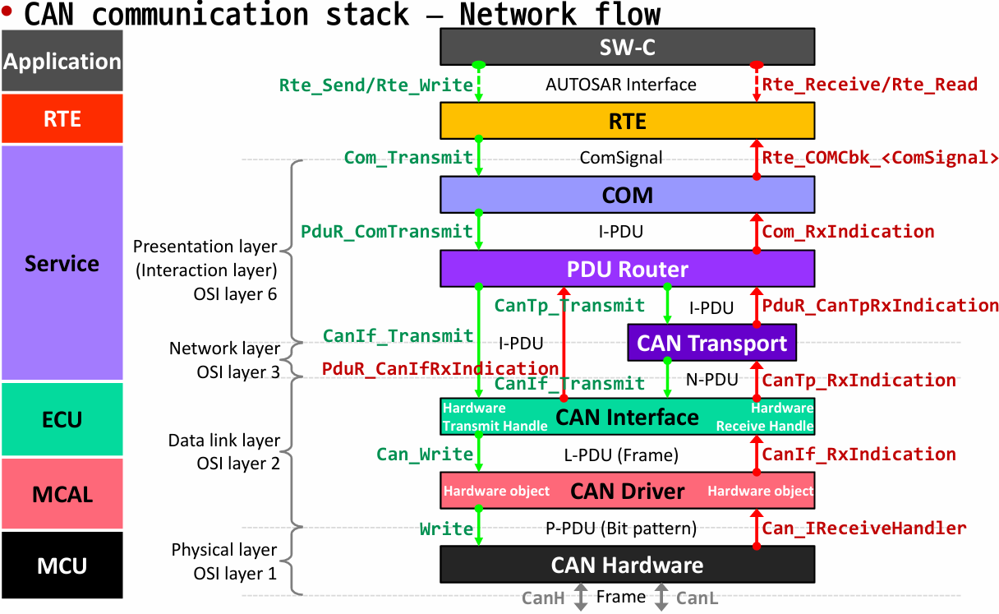

com

CAN(차량에서 가장 많이 사용)과 Ethernet 많이 사용하고,
LIN은 없어지는 추새이며 CAN을 초과하는 대역폭을 Flex-ray가 담당한다.

• 통신 하드웨어 추상화
▪ 통신 컨트롤러와 ECU 하드웨어의 위치에서 추상
 ▪ 위치에 관계없이 동일한 액세스 메커니즘을 제공합니다(온칩/온보드).
 ▪ 모든 통신 시스템에는 특정 통신 하드웨어 추상화가 필요합니다(예: LIN, CAN, FlexRay의 경우).
 ▪ 구현은 μC에 독립적이며, ECU 하드웨어와 외부 장치에 따라 다릅니다.

 Com이 가장 중요
통신 서비스 – 일반

▪ 차량 네트워크 통신을 위한 모듈 그룹(CAN, LIN, FlexRay 및 Ethernet) ▪ 통신 하드웨어 추상화를 통해 통신 드라이버와 인터페이스합니다.

◆ 네트워크 관리를 위한 균일한 서비스 제공
 ◆ 통신을 위해 차량 네트워크에 균일한 인터페이스를 제공합니다.
 ◆ 진단 통신을 위해 차량 네트워크에 균일한 인터페이스를 제공합니다.
 ◆ 응용 프로그램에서 프로토콜 및 메시지 속성 숨기기

▪ 구현은 μC 및 ECU HW와 독립적이며, 부분적으로 버스 유형에 따라 달라집니다.

 통신 서비스 – 일반
 
 ▪ AUTOSAR COM, Generic NM (Network Management) Interface 및 DCM (Diagnostic Communication Manager)은 모든 차량 네트워크 시스템에서 동일하며 ECU 당 하나의 인스턴스로 존재합니다
 
 ▪ 일반 NM 인터페이스에는 디스패처만 포함되어 있습니다.

 ◆ 추가 기능은 포함되지 않습니다.
 ◆ 게이트웨이 ECU의 경우 NM 코디네이터 기능도 포함할 수 있습니다.
 ◆ 여러 개의 서로 다른 네트워크(동일하거나 다른 유형)를 동기화하여 동기식으로 깨우거나 종료할 수 있습니다.

 
　SW-C 컴포넌트에서 autosar interface를 통해서 RTEdp ComSignal을 보낸다.
PduR

　CAN interface 위에는 어떤 특정 데이터를 보낸다는 정보만 들어가있고 이것을 몇번 controller 에 보내는지는 알지 못한다.
CAN interface 아래 부터는 명확한 controller번호와 buffer 위치까지 정해줘야 한다.

데이터의 배치가 완료되면 CAN Hardware가 data를 보낸다.

---

- ISO 15765 진단 표준이다.
전통적인 차량에는 CAN TP와 같은 TP단이 없었다. 그러나 차량 진단에 큰 데이터가 오고가면서 TP의 필요성이 증대되고 적용되었다.

