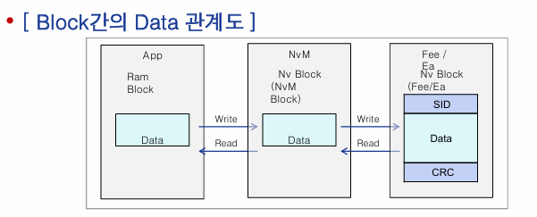

## AUTOSAR Memory Stack

Memory stack은 memory service, H/W Abstraction Driver Layer로 구성됨

## AUTOSAR Memory Basic Concept

- Basic Storage Object
  - NV block
    - EEPROM에 저장되는 Block으로 NV data와 선택적으로 CRC, block header로 구성되어 있다.

  - RAM block
    - Ram에 저장되는 Block으로 Ram data와 선택적으로 CRC, block header로 구성되어 있다
    - Ram Block은 전역변수(global data section) 로 선언해야 한다
    - Write 요청 후에는 Ram  Block의 Data를 저장해 두지 않기 때문에, 작업 완료 후까지 Ram Block의 data를 변경하면 안된다
  - ROM block
    - FLASH에 저장되는 값으로 NvBlock이 비어있거나, Data가 깨졌을 시 또는 default 값을 설정에 따라 App에게 제공한다.
  - Administrative block
    - NvM 내부에서 사용하는 관리 block으로 Block의 에러, 상태 등의 정보를 가지고 있다.
   ※ Block : EEPROM에 읽고 쓰는 단위

- NvM Block : app에서 EEPROM에 읽고 쓰는 논리적 단위
- Fee/Ea Block : 물리적으로 EEPROM에 읽고 쓰는 단위

Read : Page 단위, write보다 빠름
Write : Page 단위
Erase : Block 단위

## AUTOSAR Service implemented by the NVRAM Manage

- Ports and Port Interface
  - NVRAM block당 하나의 Port 사용
  - 