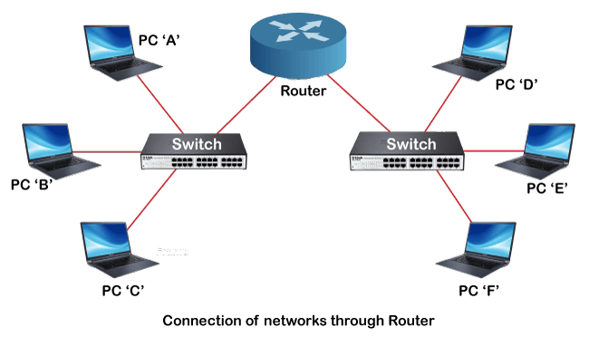

**C언어에서 하드웨어가 어떻게 제어되는가.
**
CPU는 메모리를 읽어서 명령에 따라 하드웨어를 제어한다.

## 
CAN을 사용하는건 이미 MCAL에 정의되어 있다.
나는 설계하고 검증하는것
오토에버는 MCU하고 BSW가 중요하다.
ASW는 소프트웨어로 봐지는 경우가 많다. 이건 matlab, ascat 같은거

transport
- 어플리케이션을 구분 짖는다.

`Data Link Layer는 '반도체' 이다.`

`TCP/IP는 운영체제에서 정의된다.`

### TCP/IP

IP는 소스로부터 패킷을 전달

2^16길이의 data까지 IP는 한번에 처리해줄 수 있다.

UDP는 데이터가 잘 도착했음을 가정함. 순서와 무결성도 보장하지않음. 그래서 빠름

TCP

R1, R2 라우터에서의 패킷흐름 예시 128p에 있는데 이정도는 상식으로 알고있어하다.

IP주소를 중심으로 이동하지만 결국 그 속에서 1hop은 MAC 주소를 기반으로 움직인다.
마지막에 ARP라는 통신을 사용해서 MAC을 찾는다.

MAC주소는 전체 네트워크에서 고유할 필요는 없으나 **한 스위치의 망**에서는 고유해야한다.

### MAC Control

Datalink에서 가장 중요한 기능이 MAC control로 충돌하지 안도록 제어하는 것

