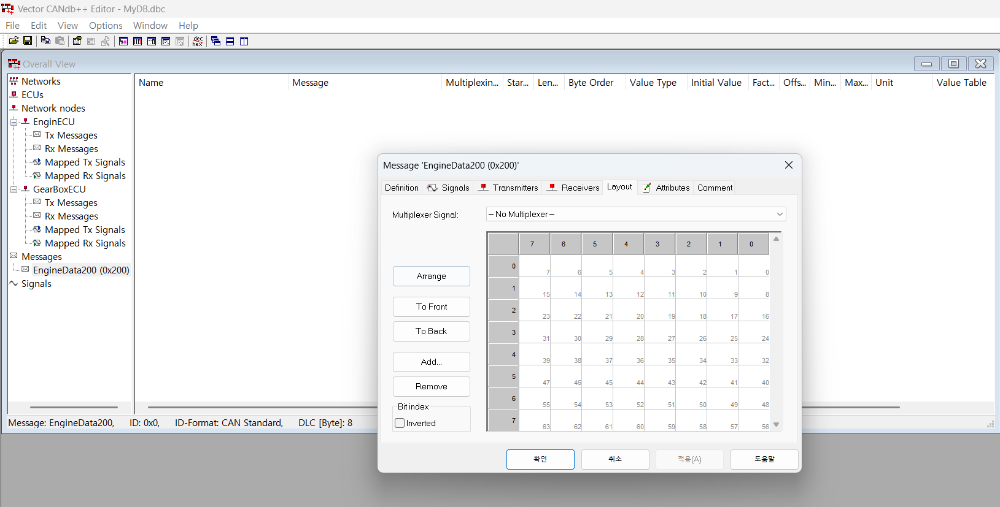
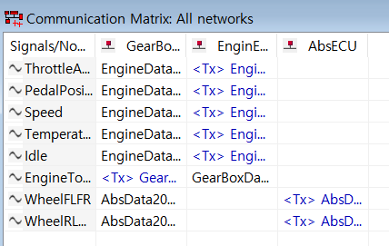
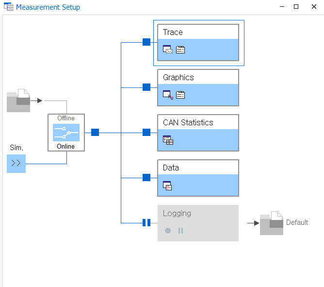
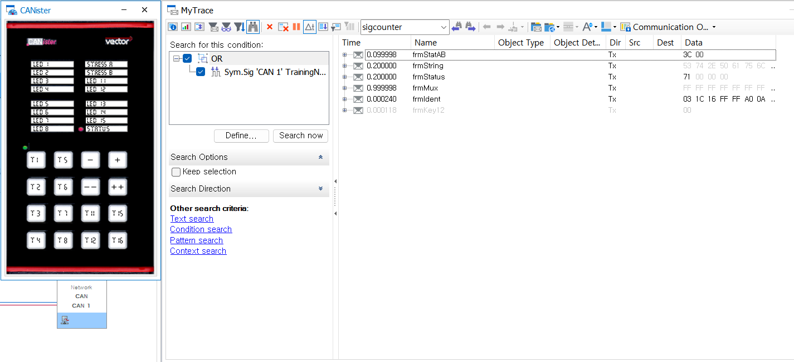
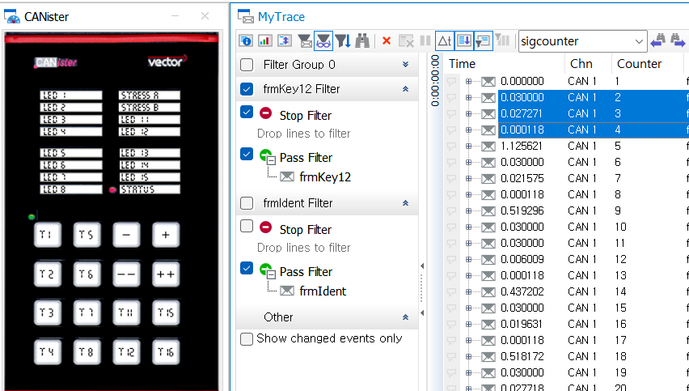
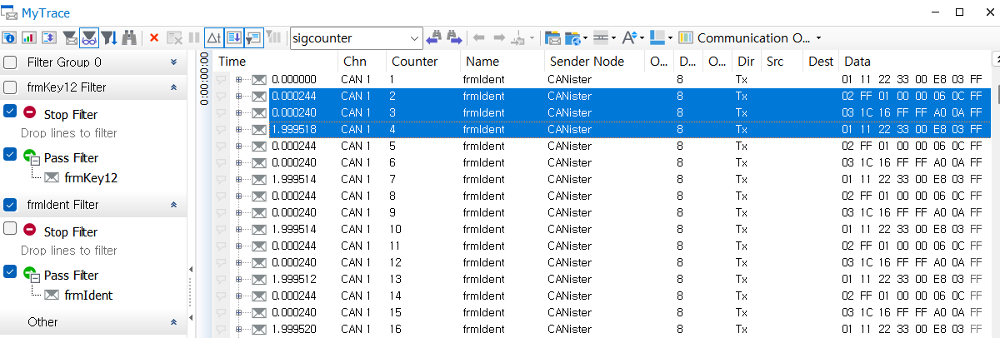
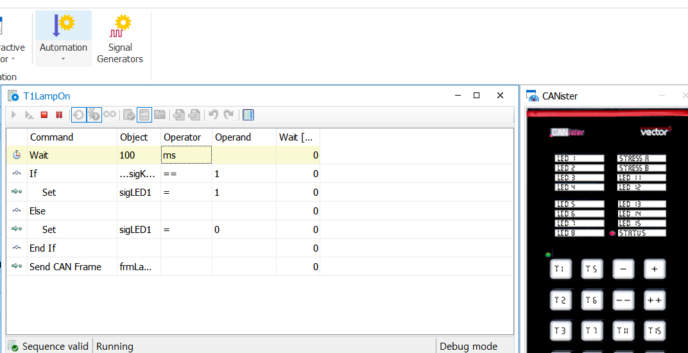

##

CANdb+++ 활용한 기초 실습

- CANape      - ECU Calibration

- CANoe       - Network
장비와 사람의 가상 생성이 가능하다.

- CANalyzer   - Network
가상은 안된다. 실제

각 measurement에 따라 실습을 진행한다.

1. 주기 30ms
2. data length 1
3. 패턴 3

1. 주기 2s
2. data length 8
3. 패턴 3

멀티플렉서 기능은 Id 재사용 기능이다.

잘 사용하는 기능은 아니지만 가볍게 특정 기능 체크 하기 좋다.