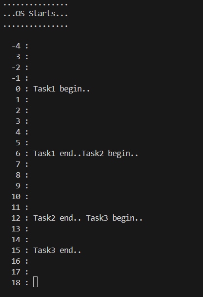
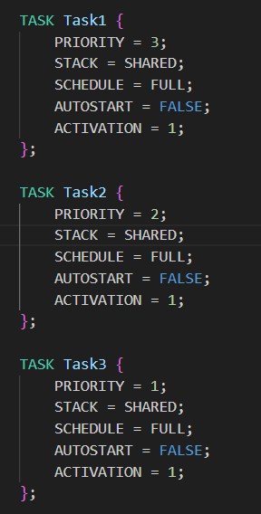
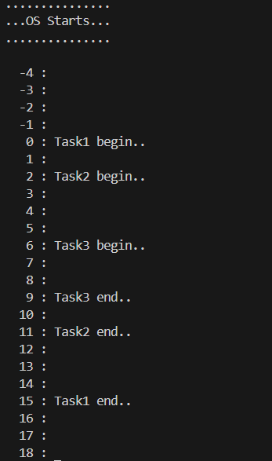

``` c
#include "bsw.h"
ISR2(TimerISR){
    static int c = -5;
    c++;
    osEE_tc_stm_set_sr0_next_match(1000000U);

    printfSerial("\n%4d : ", c);
    if(c==0){
        ActivateTask(Task1);
    }
}

TASK(Task1){
    printfSerial("Task1 begin..");
    mdelay(2000);
    ActivateTask(Task2);
    mdelay(4000);
    printfSerial("Task1 end..");
    TerminateTask(); // return 이라고 보면 된다.
}

TASK(Task2){
    printfSerial("Task2 begin.. ");
    mdelay(4000);
    ActivateTask(Task3);
    mdelay(2000);
    printfSerial("Task2 end.. ");
    TerminateTask(); // return 이라고 보면 된다.
}

TASK(Task3){
    printfSerial("Task3 begin.. ");
    mdelay(3000);
    printfSerial("Task3 end.. ");
    
    TerminateTask(); // return 이라고 보면 된다.
}
```

우선순위에 따라 task의 흐름이 달라지는 것을 확인할 수 있따.
