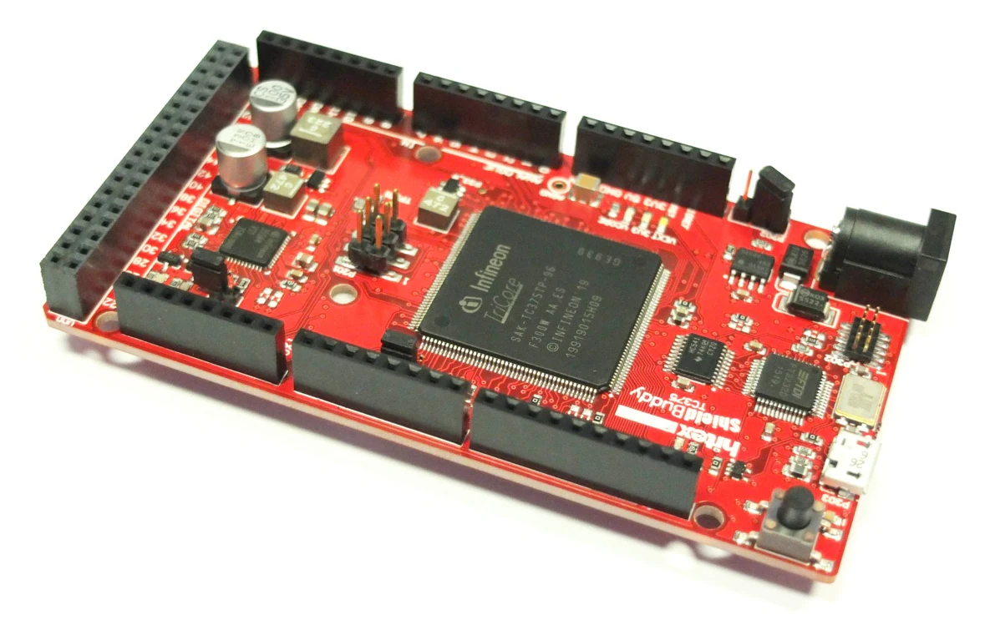

## Loadmap
1. GPIO 
   1. IDE
   2. Interface
   3. editor
2. Preemptive Scheduling
   1. 설계를 진행할 것
3. ADC, PWM - AI(아날로그 I/O)


# 임베디드 시스템 개발 로드맵 (Infineon 보드 기반)

## 1. GPIO (General Purpose Input/Output)
GPIO는 마이크로컨트롤러에서 디지털 신호를 입력받거나 출력하는 핀을 의미함.  
Infineon의 PSoC 및 XMC 시리즈에서 GPIO를 활용하여 센서, LED, 모터 등 다양한 하드웨어를 제어할 수 있음.

## 1.1 IDE (Integrated Development Environment)
Infineon 보드에서 사용 가능한 IDE는 다음과 같음.

- ModusToolbox : Infineon의 공식 개발 환경, PSoC 및 XMC 시리즈 지원
- DAVE IDE : XMC 마이크로컨트롤러 전용 Eclipse 기반 IDE
- Keil uVision : ARM Cortex 기반 MCU 개발용
- VS Code + GCC ARM Toolchain : Infineon MCU 개발 가능
- PlatformIO : 일부 Infineon 보드 지원

## 1.2 Interface
GPIO의 인터페이스는 다음과 같음.

- 입력 모드 (Input Mode) : 버튼, 센서 신호를 읽을 때 사용
- 출력 모드 (Output Mode) : LED, 모터 드라이버 등 제어
- 특수 모드
  - PWM (Pulse Width Modulation) : LED 밝기 조절, 모터 속도 제어
  - ADC (Analog-to-Digital Converter) : 아날로그 신호를 디지털로 변환
  - UART, SPI, I2C : 다른 장치와 통신을 위한 프로토콜 지원

## 1.3 Editor
Infineon 보드는 ModusToolbox를 주로 사용하며, VS Code, Keil, Eclipse 등도 활용 가능함.

## 2. Preemptive Scheduling (선점형 스케줄링)
운영체제가 여러 개의 태스크를 실행할 때 특정 태스크를 강제로 중단시키고 다른 태스크를 실행할 수 있도록 하는 방식임.  
Infineon MCU에서 RTOS (Real-Time Operating System)를 활용하여 구현 가능함.

## 2.1 선점형 스케줄링의 특징
- 태스크 우선순위 기반으로 실행됨
- 운영체제가 실행 중인 태스크를 강제로 중단하고 다른 태스크로 전환 가능
- FreeRTOS, RTX RTOS, Zephyr OS 등에서 활용됨

## 2.2 설계 진행
- RTOS 환경에서 태스크 우선순위와 실행 시간 고려
- 컨텍스트 스위칭 비용 최소화
- FreeRTOS를 Infineon MCU에 적용하여 테스트 가능

## 3. ADC, PWM - AI(아날로그 I/O)
아날로그 신호를 디지털로 변환하는 ADC와 디지털 신호로 아날로그 효과를 구현하는 PWM은 센서 및 모터 제어에 필수적인 요소임.

## 3.1 ADC (Analog-to-Digital Converter)
ADC는 아날로그 신호를 디지털 값으로 변환하는 기능을 수행함.  
온도 센서, 조도 센서 등의 데이터를 MCU에서 처리할 때 사용됨.

## 3.2 PWM (Pulse Width Modulation)
PWM은 디지털 신호의 듀티 사이클(Duty Cycle)을 조절하여 아날로그 출력을 모방하는 방식임.  
모터 속도 조절, LED 밝기 조절 등에 사용됨.

## 정리
이 로드맵은 Infineon 보드를 활용한 GPIO, 선점형 스케줄링(Preemptive Scheduling), ADC/PWM(아날로그 I/O) 구현을 목표로 함.  
각 항목별로 ModusToolbox 및 FreeRTOS 환경에서 실행 가능한 기능을 학습하며, 실습을 통해 하드웨어 제어를 익히는 것이 중요함.

## 추가 학습 추천
- RTOS를 활용한 멀티태스킹
- 인터럽트(Interrupt) 기반 GPIO 제어
- DMA를 활용한 고속 데이터 처리
- 저전력 모드 및 성능 최적화 방법


## 임베디드 소프트웨어 개발 기초

컴퓨터 시스템의 HW 구조
프로그램 카운터가 CPU위치를 읽어서 

## 요건 알아야된다
논리회로
회로이론
컴퓨터구조
운영체제
C프로그래밍

## 프로세서
### 마이크로 프로세서
고속연산 및 대용량 메모리 처리
CPU, MPU(Micro Processor Unit)
### 마이크로 컨트롤러
기계, 장치를 제어하기 위해 사용하는 프로그래밍이 가능한 칩
MCU(Micro Control Unit)
마이크로 프로세서에서 주변 장치들이 추가된 것 

ㅁ우리는 임피니언 보드를 이용해서 진행할 것. 클럭 오실레이터가 옆에 같이 있다.



Linker 파일을 포함해서 생성되는 elk 파일
빌드하면 생긴다.


## GPIO 개발
1. 회로파악
2. 핀/레지스터 설정 파악
3. 코드구현
순서로 진행된다.

### 포트와 핀과 Datasheet
포트 -> 핀 
포트로 나누어져 있고 핀으로 세분화
Datasheet를 참고

## 스위치
### Push-pull
### Open drain

IOCR을 사용한다. 

D12 D13 연결되어 있는 LED 켜기
``` c
#include "Ifx_Types.h"
#include "IfxCpu.h"
#include "IfxScuWdt.h"
#define PCn_2_IDX 19
#define P2_IDX 2
#define P1_IDX 1
IfxCpu_syncEvent g_cpuSyncEvent = 0;

void initLED(void); // 이거
void core0_main(void)
{
    IfxCpu_enableInterrupts();
    
    /* !!WATCHDOG0 AND SAFETY WATCHDOG ARE DISABLED HERE!!
     * Enable the watchdogs and service them periodically if it is required
     */
    IfxScuWdt_disableCpuWatchdog(IfxScuWdt_getCpuWatchdogPassword());
    IfxScuWdt_disableSafetyWatchdog(IfxScuWdt_getSafetyWatchdogPassword());
    
    /* Wait for CPU sync event */
    IfxCpu_emitEvent(&g_cpuSyncEvent);
    IfxCpu_waitEvent(&g_cpuSyncEvent, 1);
        
    initLED();
    while(1)
    {
        P10_OUT.U = 0x6;
//        P10_OUT.U = 0x1;
    }
}

void initLED(void){
    P10_IOCR0.U &= ~(0x1F << PCn_2_IDX);
    P10_IOCR0.U |= 0x10 << PCn_2_IDX;

//    P10_IOCR0.U &= ~(0x1F << PCn_2_IDX);
    P10_IOCR0.U |= 0x10 << 11;
}

```


2 to 16 바꾸기 연습

``` c
    initGPIO();
    while(1)
    { // pull up button이기 때문에 땠을 때 1이 된다.
        if((P02_IN.U & (0x1 << P1_IDX))==0){ // 눌렀을 때, P02_IN.U = 0 이된다.
            P10_OMR.U = 0x1 << 1;
            P10_OMR.U |= 0x0 << 17;

            P10_OMR.U &= ~(0x0 << 2);
            P10_OMR.U |= 0x1 << 18;

        }// 눌렀을때
        else{
            P10_OMR.U = 0 << 1;
            P10_OMR.U |= 0x1 << 17;

            P10_OMR.U |= 0x1 << 2;
            P10_OMR.U &= ~(0x1 << 17);
        }// 아닐때
    }

    return;
}

void initGPIO(void){
    P10_OMR.U = 0;
    P02_IOCR0.U &= ~(0x1F << PCn_1_IDX);
    P02_IOCR0.U |= 0x02 << PCn_1_IDX;
//    P10_OMR.U
    P10_IOCR0.U &= ~(0x1F << PCn_2_IDX);
    P10_IOCR0.U |= 0x10 << PCn_2_IDX;

    P10_IOCR0.U &= ~(0x1F << PCn_1_IDX);
    P10_IOCR0.U |= 0x10 << PCn_1_IDX;
}

```
일반적으로 assign문에서 5clock사용함
일반적으로 한줄에 5~10 clock 사용


```c
    P10_OMR.U = 0x20004;
    while(1)
    { // pull up button이기 때문에 땠을 때 1이 된다.


        // 방법 1
        ppushed = pushed;
        if((P02_IN.U & (0x1 << P1_IDX))==0){ // 눌렀을 때, P02_IN.U = 0 이된다.
            pushed = 1;
        }else pushed = 0;
        if((!pushed == ppushed) && pushed){
            P10_OMR.U = 0x60006;
        }
        P10_OMR.U = 0x00000;
        // ---------------------


        // 방법 2
        if(P02_IN.U & (0x1 << P1_IDX)){
            while(1){
                P10_OMR.U = 0x60006;
                if ((P02_IN.U & (0x1 << P1_IDX))==0) {
                    break;
                }
            }
        }
        P10_OMR.U = 0x00000;
        // ---------------------
        /*
        Deadlock(데드락)이란, 일련의 프로세스들이 서로가 가진 자원을 기다리며 block 되어 더 이상 진행이 될 수 없는 상태를 말한다.
        */

        // 교수님 풀이
        // 1st solution
        curSW = P02_IN.U & (0x1<<P1_IDX);
        if(preSW && !curSW){
            P10_OMR.U=0x20002;
        }
        preSW = curSW;

        //2nd solution
        if (!(P02_IN.U & (0x1<<P1_IDX))){
            P10_OMR.U=0x20002;
            while(!(P02_IN.U & (0x1<<P1_IDX))) ;
        }

        //3rd solution
        if (!(P02_IN.U & (0x1<<P1_IDX))){
            cnt++;
        }
        if((P02_IN.U & (0x1<<P1_IDX))){
            if (cnt>1000){
                P10_OMR.U=0x20002;
            }
            cnt = 0;
        }

        //delay
        if (!(P02_IN.U & (0x1<<P1_IDX))){
            P10_OMR.U=0x20002;
            delay(1000);
        }
    }
```

## 인터럽트

### ISR 호출 및 실행
ISR 호출을 위한 3조건
1. 전역적 인터럽트 활성 비트 세트
2. 인터럽트 별 인터럽트 활성화 비트 셋
3. 인터럽트 발생 조건 충족

### 인터럽트 처리 순서
2번 인터럽트 발생했다고 가정
> Program Counter를 인터러트 벡터 테이블의 2번 위치로 이동
> 해당 ISR

``` c
#include "Ifx_Types.h"
#include "IfxCpu.h"
#include "IfxScuWdt.h"

IfxCpu_syncEvent g_cpuSyncEvent = 0;

#define PCn_1_IDX 11 // D12
#define PCn_2_IDX 19 // D13
#define PCn_3_IDX 27 // D10

#define P1_IDX 1 // D12
#define P2_IDX 2 // D13
#define P3_IDX 3 // D10

#define PSn_1_IDX 1
#define PSn_2_IDX 2
#define PCLn_1_IDX 17
#define PCLn_2_IDX 18

#define EXIS0_IDX 4     // external input selection, 0: input 20 1: input 21...
#define FEN0_IDX 8      // falling edge enable, 0: not used 1: falling edge
#define EIEN0_IDX 11    // external input enable, 0: disabled 1: enabled
#define INP0_IDX 12     // input node pointer, 000: trigger output OGU0
#define IGP0_IDX 14     // interrupt gating pattern, 01: IOUT is activated in a trigger event. pattern is not considered.
#define SRE_IDX 10
#define TOS_IDX 11

#define REN0_IDX 9      // rising edge enable, 0: not used 1: rising edge

void initGPIO(void);
void initERU(void);

int state = 0;

IFX_INTERRUPT(ISR0, 0, 0x10); // (isr, vectabNum, prio)
void ISR0(void) {
    P10_OUT.U = 0x1 << P1_IDX;
}

int core0_main(void)
{
    IfxCpu_enableInterrupts();
    
    /* !!WATCHDOG0 AND SAFETY WATCHDOG ARE DISABLED HERE!!
     * Enable the watchdogs and service them periodically if it is required
     */
    IfxScuWdt_disableCpuWatchdog(IfxScuWdt_getCpuWatchdogPassword());
    IfxScuWdt_disableSafetyWatchdog(IfxScuWdt_getSafetyWatchdogPassword());

    /* Wait for CPU sync event */
    IfxCpu_emitEvent(&g_cpuSyncEvent);
    IfxCpu_waitEvent(&g_cpuSyncEvent, 1);

    initGPIO();
    initERU();

    while(1)
    {
    }

    return 1;
}

void initGPIO(void) {

    P10_IOCR0.U &= ~(0x1f << PCn_2_IDX);
    P10_IOCR0.U &= ~(0x1f << PCn_1_IDX);
    P10_IOCR0.U |= 0x10 << PCn_2_IDX;
    P10_IOCR0.U |= 0x10 << PCn_1_IDX;

    P02_IOCR0.U &= ~(0x1f << PCn_1_IDX);
    P02_IOCR0.U |= 0x02 << PCn_1_IDX;
}

void initERU(void) {
    // P2.1을 인터럽트로 사용하도록 설정
    // set EICR - system control unit (SCU)의
    SCU_EICR1.U &= ~(0x6 << EXIS0_IDX);
    SCU_EICR1.U |= 0x1 << EXIS0_IDX; // input select

    SCU_EICR1.U |= 0x1 << REN0_IDX;  // trigger edge
    SCU_EICR1.U |= 0x1 << EIEN0_IDX; // enable

    SCU_EICR1.U &= ~(0x7 << INP0_IDX);

    // set IGCR -
    SCU_IGCR0.U &= ~(0x3 << IGP0_IDX);
    SCU_IGCR0.U |= 0x1 << IGP0_IDX;

    // set SCUERU
    SRC_SCU_SCU_ERU0.U &= ~0xFF; // Service request is on lowest priority
    SRC_SCU_SCU_ERU0.U |= 0x10;  // ?

    SRC_SCU_SCU_ERU0.U |= 0x1 << SRE_IDX; // Service Request Enable
    SRC_SCU_SCU_ERU0.U &= ~(0x3 << TOS_IDX); // CPU0 is initiated

}


```

``` c
// ERU related
#define EXIS0_IDX 4
#define FEN0_IDX 8
#define EIEN0_IDX 11
#define INP0_IDX  12
#define IGP0_IDX  14

// SRC related
#define SRE_IDX 10
#define TOS_IDX 11

IfxCpu_syncEvent g_cpuSyncEvent = 0;

IFX_INTERRUPT(ISR0,0,0x10);
IFX_INTERRUPT(ISR1,0,0x20);
void ISR0(void){
    P10_OUT.U = 0x1 << P2_IDX;
    P10_OUT.U &= ~(0x1 << P1_IDX);
}
void ISR1(void){
    P10_OUT.U = 0x1 << P1_IDX;
    P10_OUT.U &= ~(0x1 << P2_IDX);
}
void initGPIO(void); // 이거
void initERU(void);

void core0_main(void)
{
    IfxCpu_enableInterrupts();
    
    /* !!WATCHDOG0 AND SAFETY WATCHDOG ARE DISABLED HERE!!
     * Enable the watchdogs and service them periodically if it is required
     */
    IfxScuWdt_disableCpuWatchdog(IfxScuWdt_getCpuWatchdogPassword());
    IfxScuWdt_disableSafetyWatchdog(IfxScuWdt_getSafetyWatchdogPassword());

    /* Wait for CPU sync event */
    IfxCpu_emitEvent(&g_cpuSyncEvent);
    IfxCpu_waitEvent(&g_cpuSyncEvent, 1);


    initGPIO();
    initERU();
    while(1)
    {

    }
    return;
}

void initGPIO(void){
    P02_IOCR0.U &= ~(0x1F << PCn_0_IDX);
    P02_IOCR0.U |= 0x02;                // SW D1
    P02_IOCR0.U &= ~(0x1F << PCn_1_IDX);
    P02_IOCR0.U |= 0x02 << PCn_1_IDX;   // SW D3

    P10_IOCR0.U &= ~(0x1F << PCn_2_IDX);
    P10_IOCR0.U |= 0x10 << PCn_2_IDX;
    P10_IOCR0.U &= ~(0x1F << PCn_1_IDX);
    P10_IOCR0.U |= 0x10 << PCn_1_IDX;
}

void initERU(void){
    SCU_EICR1.U &= ~(0x7 << EXIS0_IDX);
    SCU_EICR1.U |= 0x1 << EXIS0_IDX;
    SCU_EICR1.U |= 0x1 << FEN0_IDX;
    SCU_EICR1.U |= 0x1 << EIEN0_IDX;
    SCU_EICR1.U &= ~(0x7 << INP0_IDX);

    SCU_EICR1.U &= ~(0x7 << (EXIS0_IDX + 16));
    SCU_EICR1.U |= 0x2 << (EXIS0_IDX + 16);
    SCU_EICR1.U |= 0x1 << (FEN0_IDX + 16);
    SCU_EICR1.U |= 0x1 << (EIEN0_IDX + 16);
    SCU_EICR1.U &= ~(0x7 << (INP0_IDX + 16));
    SCU_EICR1.U += 0x1 << (INP0_IDX + 16); // OGU1번 사용

    SCU_IGCR0.U &= ~(0x3 << IGP0_IDX);
    SCU_IGCR0.U |= 0x1 << IGP0_IDX;

    SCU_IGCR0.U &= ~(0x3 << (IGP0_IDX+16));
    SCU_IGCR0.U |= 0x1 << (IGP0_IDX+16);

    SRC_SCU_SCU_ERU0.U &= ~0XFF;
    SRC_SCU_SCU_ERU0.U |= 0X10;
    SRC_SCU_SCU_ERU0.U |= 0x1 << SRE_IDX;
    SRC_SCU_SCU_ERU0.U &= ~(0x3 << TOS_IDX);

    SRC_SCU_SCU_ERU1.U &= ~0XFF;
    SRC_SCU_SCU_ERU1.U |= 0X20;
    SRC_SCU_SCU_ERU1.U |= 0x1 << SRE_IDX;
    SRC_SCU_SCU_ERU1.U &= ~(0x3 << TOS_IDX);

}


```

- Blink 실습 정답

``` c
#define STOP 0
#define BLINK 1

IfxCpu_syncEvent g_cpuSyncEvent = 0;
int state = STOP;

void initGPIO (void);
void initERU (void);

IFX_INTERRUPT(ISR0,0,0x10);
void ISR0(void){

    //state transition
    switch(state){
        case STOP:
            state = BLINK;
            break;
        case BLINK:
            state = STOP;
            break;
        default:
            state = STOP;
    }
}
//IFX_INTERRUPT(ISR1,0,0x20);
//void ISR1(void){
////    P10_OUT.U = 0x1 << P2_IDX;
//    P10_OMR.U = 0x40004;
//    state = !state;
//}

void core0_main(void)
{
    IfxCpu_enableInterrupts();
    
    /* !!WATCHDOG0 AND SAFETY WATCHDOG ARE DISABLED HERE!!
     * Enable the watchdogs and service them periodically if it is required
     */
    IfxScuWdt_disableCpuWatchdog(IfxScuWdt_getCpuWatchdogPassword());
    IfxScuWdt_disableSafetyWatchdog(IfxScuWdt_getSafetyWatchdogPassword());
    
    /* Wait for CPU sync event */
    IfxCpu_emitEvent(&g_cpuSyncEvent);
    IfxCpu_waitEvent(&g_cpuSyncEvent, 1);
        
    initGPIO();
    initERU();
    P10_OUT.U = 0x1<<1;

    while(1)
    {
        // state에 따른 동작
        switch(state){
            case BLINK:
                P10_OMR.U = 0x60006;
                for (int i=0 ; i<10000000; i++) ;
                break;
            case STOP:
            default:
                break;
        }
////        if(state){
//            P10_OMR.U = 0x60006*state;
//            for (int i=0 ; i<10000000; i++) ;
////        }
    }
}
```
