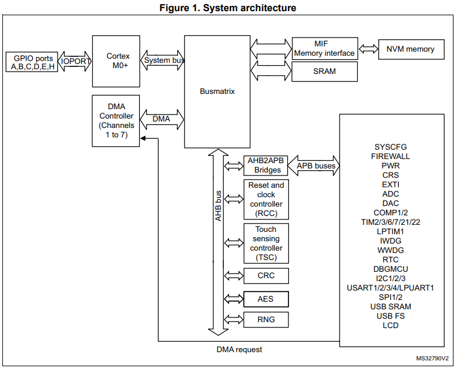
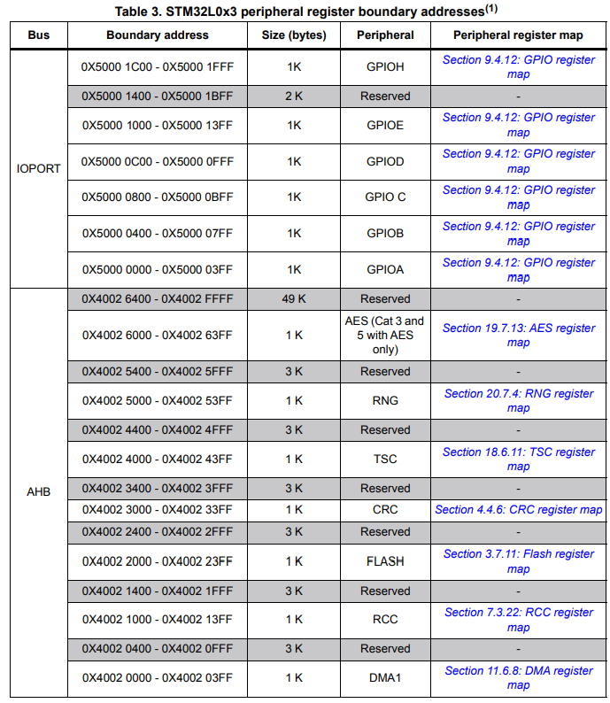
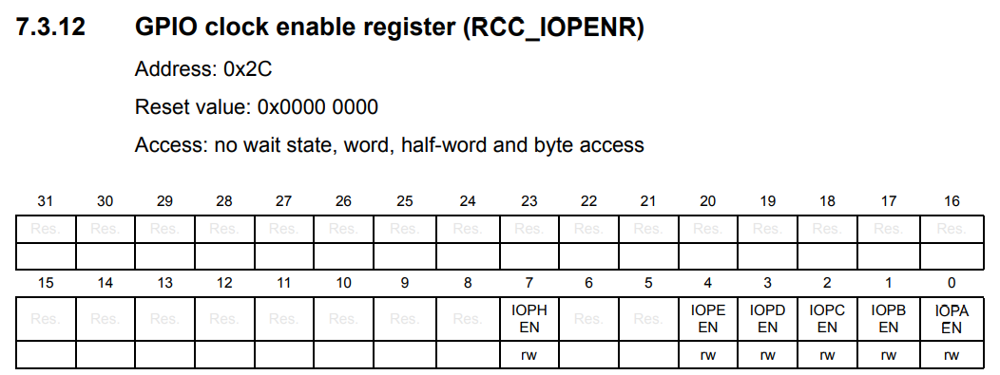

## MCU Bring-Up
Firmware를 통해 MCU가 기본적으로 동작하는 것

## I/O Access 방법법
- Special Instruction I/O
- Memory-mapped I/O
  -  SPI/I2C/UART 등 커뮤니케인션 쪽에서 많이 사용용
- Direct memory access (DMA)

## 저항
- PULL UP
- PULL DOWN
Pull up을 더 많이 쓴다. 눌렀을 때, 0이기 때문에 더 확실하게 구분이 가능이다. 많일 Pull Down일 경우 눌렀을 때 1인데 이 때 voltage의 threshold를 정확하게 분간하기 어려운 경우도 있기 때문
- Open Drain

## clock의 생성
Reset and Clock Controller

1. stm32nucleo user sheet 에서 stm32 pin 번호 확인
2. RCC register Map setting 

## Little Endian vs Big Endian

## Memory Map

60page - 
GPIO A~H 까지 기준이 뭔가

GPIOA 0X5000 0000 - 0X5000 03FF
RCC 0X4002 1000 - 0X4002 13FF
=> RCC_IOPENR

여기보면 IOPAEN을 열어줘야 GPIOA가 사용가능함.
- Reset and Clock Control(RCC)
  -  리셋과 클럭을 제어하는 장치로 STM32에서 사용
  - MCU의 리셋과 클럭을 제어
  - 입력 클럭을 제어
  - 시스템 클럭(SYSCLK)을 동작시키는 소스 클럭을 설정
  - Clock의 환경설정