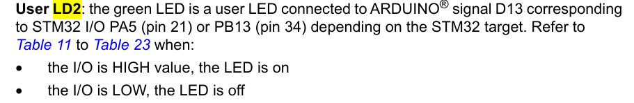
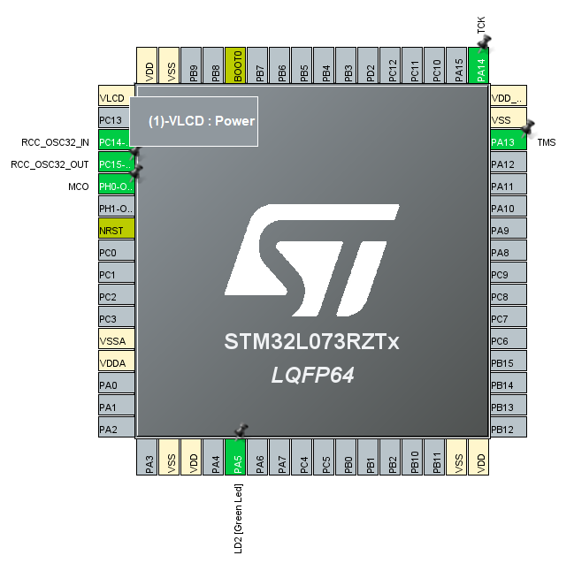

## STM32nucleo datasheet만 이용해서 내부 LED2번과 외부 LED를 연결해서 toggle해보자.

um1724-stm32-nucleo64-boards-mb1136-stmicroelectronics datasheet을 활용하자.
### LE2 번의 green LED를 제어하자.

먼저 Nucleo 보드의 LD2의 포트와 핀을 확인하자.

STM32 I/O PA5 (pin 21) or PB13 (pin 34) 

기본셋팅이 되어 있다.

PA5번은 GPIOA port의 pin 5번이다.