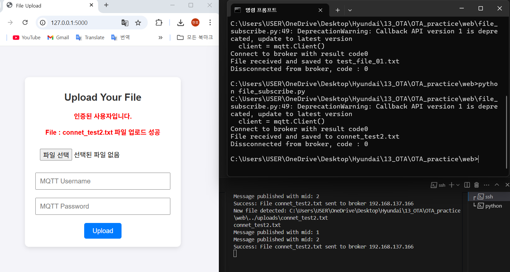

## OTA (Over-the-Air) 업데이트란?

OTA 업데이트는 무선 네트워크를 통해 소프트웨어를 원격으로 업데이트하는 기술로 현재 많은 OEM들이 모빌리티 시스템에서 적용하기 위해 노력중이다.

---

OTA기술은 SOTA와 FOTA로 나뉘는데 소프트웨어 업데이트와 펌웨어 업데이트 시스템이다.

2023년 현대차 

### 주요 특징

1. **편리성**: 사용자는 물리적인 연결 없이 업데이트를 받을 수 있습니다.
2. **효율성**: 제조사는 빠르게 소프트웨어를 배포하고 문제를 해결할 수 있습니다.
3. **보안성**: 최신 보안 패치를 신속히 적용할 수 있습니다.

---

### OTA 업데이트의 활용 사례

- **자동차**: 차량의 내비게이션 시스템, 엔진 제어 소프트웨어 업데이트.
- **스마트폰**: 운영 체제 및 앱의 최신 버전 배포.
- **IoT 기기**: 스마트 홈 디바이스의 기능 개선 및 버그 수정.

---

### 결론

OTA 업데이트는 현대 기술 환경에서 필수적인 요소로 자리 잡았습니다. 이를 통해 사용자 경험을 개선하고, 디바이스의 수명을 연장하며, 보안을 강화할 수 있습니다.

---

**참고 자료**  
- [OTA 기술의 이해](#)
- [Autoever 공식 웹사이트](#)

